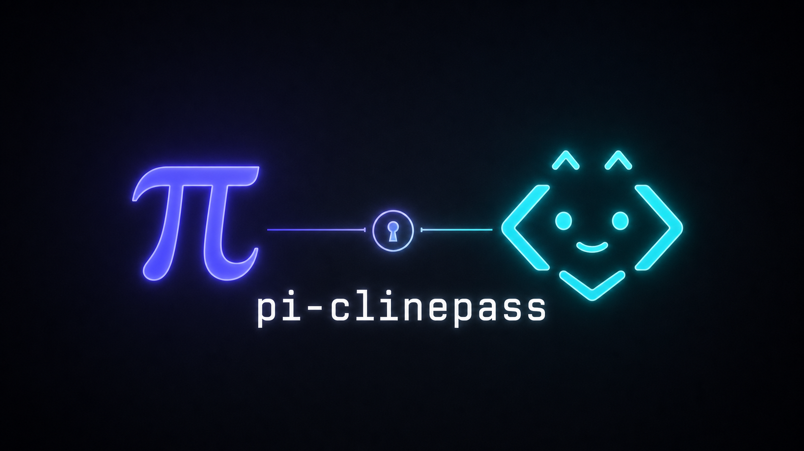

# pi-clinepass



ClinePass models inside Pi through Pi's native provider system.

`pi-clinepass` registers a real `clinepass` provider with OAuth device login, live ClinePass model discovery, Pi-compatible OpenAI chat transport, prompt cache markers, and reasoning controls tuned for GLM/Qwen/Kimi/DeepSeek-style models.

## What works

- Provider id: `clinepass`
- Primary model: `cline-pass/glm-5.2`
- Auth: Pi `/login` OAuth device-code flow
- Model list: live Cline recommended-models endpoint, filtered to `clinePass[]`
- Transport: `openai-completions` against `https://api.cline.bot/api/v1`
- Token handling: Pi stores OAuth credentials; this package returns `workos:<access>` only to Pi's provider auth path
- Reasoning: Pi thinking levels map to ClinePass-compatible `reasoning` params
- Prompt caching: Pi emits Anthropic-style cache-control markers where supported

No API key required. No tokens printed.

## Install locally

From a checkout:

```bash
bun install
bun run typecheck
bun test
pi install .
```

From GitHub:

```bash
pi install git:github.com/codewithkenzo/pi-clinepass
```

Or add a local checkout manually to `~/.pi/agent/settings.json`:

```json
{
  "packages": ["../../dev/pi-clinepass"]
}
```

Then restart Pi or run `/reload`.

## Login + use

In Pi:

1. Run `/login`
2. Choose **ClinePass**
3. Open the browser/device URL and enter the shown code
4. Run `/model`
5. Pick `clinepass/cline-pass/glm-5.2`

Exact model string for CLI/non-interactive runs:

```bash
pi --model clinepass/cline-pass/glm-5.2 "Say OK"
```

## Model discovery

The extension fetches:

```text
https://api.cline.bot/api/v1/ai/cline/recommended-models
```

It reads `clinePass[]`, dedupes model ids, and falls back to a small built-in list if discovery is unavailable.

Known models include:

- `cline-pass/glm-5.2` — 1M context, 131K output
- `cline-pass/qwen3.7-max` — 1M context, 66K output
- `cline-pass/qwen3.7-plus` — 1M context, 66K output
- `cline-pass/kimi-k2.7-code` — 256K context
- `cline-pass/deepseek-v4-pro` — 1M context, 384K output
- `cline-pass/deepseek-v4-flash` — 1M context, 384K output
- `cline-pass/minimax-m3` — 1M context, 512K output

## OAuth behavior

Flow:

1. Start WorkOS device auth with Cline's production client id.
2. Show Pi device-code/browser callbacks.
3. Poll WorkOS until approved.
4. Register WorkOS tokens with Cline `/api/v1/auth/register`.
5. Return Pi `OAuthCredentials` with Cline access/refresh/expires metadata.
6. Refresh through Cline `/api/v1/auth/refresh` when needed.
7. Send requests with `Authorization: Bearer workos:<access>`.

Token rule: this repo never logs access or refresh tokens.

## ClinePass compatibility

Each model is registered with:

```ts
{
  api: "openai-completions",
  input: ["text"],
  contextWindow: 1_000_000, // per-model from vendor docs
  maxTokens: 131_072,       // per-model from vendor docs
  reasoning: true,
  compat: {
    thinkingFormat: "together",
    cacheControlFormat: "anthropic",
    supportsUsageInStreaming: true,
    supportsReasoningEffort: true,
    supportsStore: false,
    supportsDeveloperRole: false,
    maxTokensField: "max_tokens"
  }
}
```

Why `thinkingFormat: "together"`:

- ClinePass accepts top-level `reasoning` objects.
- `{ reasoning: { enabled: false } }` suppresses GLM reasoning.
- Pi's OpenRouter-style off state emits `{ reasoning: { effort: "none" } }`, which ClinePass does not suppress.
- z.ai-native `thinking: { type: "disabled" }` is also ignored by ClinePass.

## Development

```bash
bun install
bun run typecheck
bun test
```

Useful smoke test after local install:

```bash
pi --model clinepass/cline-pass/glm-5.2 -p "Reply exactly OK"
```

If it says `No API key found for clinepass`, the extension loaded correctly; run `/login`.

## Package surface

Pi loads this package through:

```json
{
  "pi": {
    "extensions": ["./src/index.ts"]
  }
}
```

Runtime entrypoint: `src/index.ts`.

